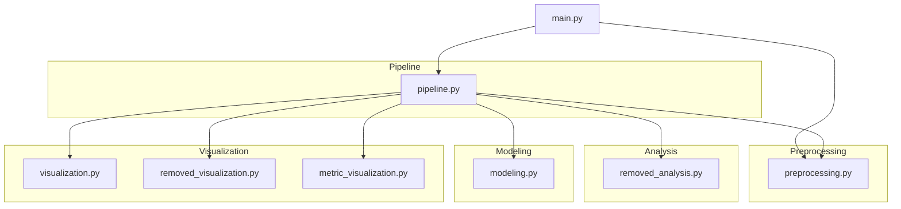

# SG–BG Data Preprocessing & Outlier Validation Pipeline

본 프로젝트는 **타액당(SG) 기반 혈당(BG) 예측 데이터**에서 다양한 전처리(이상치 제거) 기법을 적용하고, **“무엇이, 왜 제거되었는지”를 통계적·시각적으로 검증**하는 파이프라인입니다.

단순히 모델 성능을 높이는 것이 아니라, **전처리 결과의 타당성을 정량적 근거로 설명하는 것**을 목표로 합니다.

---

## 📌 프로젝트 핵심 목적

- 다양한 전처리 기법이 **어떤 데이터를 제거하는지** 비교
- 제거된 데이터가
  - 단순 노이즈인지
  - 구조적으로 다른 집단인지 통계적으로 검증
- 전처리 과정의 **설명 가능성(Explainability)** 확보

---

## 📁 프로젝트 구조

 - 프로젝트 흐름도



## 🗂️ 폴더 구조
```
    ├── main.py
    ├── data/
    │   └── dataset_update.csv
    ├── results/
    │ ├── 01_range_filter/
    │ ├── 02_residual_filter/
    │ ├── 03_isolation_forest/
    └── pipeline/
    ├── pipeline.py
    ├── preprocessing.py
    ├── modeling.py
    ├── visualization.py
    ├── metric_visualization.py
    ├── removed_analysis.py
    └── removed_visualization.py
```
---
## ⚙️ 실행 방법

### 1️⃣ 데이터 준비
- `data/dataset_update.csv` 파일 필요
- 필수 컬럼:
  - `SG`, `BG`
  - `Meal_Status`, `BMI_Class`, `Age_Group`, `Exercise`, `Family_History`, `Pregnancy`

### 2️⃣ 실행
```bash
python main.py
```

---
## 🔄 전체 파이프라인 흐름

1. Raw 데이터 로드

2. 전처리 실험 반복 실행

    - Range Filter

    - Residual-based Filter

    - Isolation Forest

3. 각 전처리별로

    - 제거된 데이터 추출

    - 통계 분석

    - 시각화

---

## 🧪 적용된 전처리 기법

### 1️⃣ Range Filter
```bash 
BG ∈ [70, 140]
```

 - 물리적으로 비현실적인 혈당 범위 제거. 가장 단순하지만 정보 손실 가능성 큼

### 2️⃣ Residual-based Filter

- SG → BG 선형 회귀 모델 학습

- 예측값 대비 잔차(residual)가 큰 샘플 제거

- SG–BG 관계에서 벗어난 데이터 제거

### 3️⃣ Isolation Forest

- SG–BG 2차원 공간에서 밀도 기반 이상치 탐지

- 분포상 희귀한 조합 제거

- 비선형·다변량 이상치 탐지에 강점

---

## 📊 제거된 데이터 검증 방법

    - 각 전처리 실험 폴더에는 다음 결과물이 자동 생성됩니다.

### 1️⃣ 기술통계

- `removed_descriptive_stats.csv`

- 제거된 데이터의 기본 분포 확인

### 2️⃣ 카테고리별 제거 현황

- `removed_vs_kept_<변수>.csv`

- 인구학적 편향 여부 확인

### 3️⃣ 통계 검정 (핵심)

- `removed_statistical_tests.csv`

- 사용한 검정: t-test: 평균 차이, KS-test: 분포 차이

4️⃣ 시각화

- SG–BG 산점도 (Removed vs Kept)

- 변수별 제거/유지 비율 막대그래프

---

## 🧠 이 프로젝트의 특징

 - 전처리를 블랙박스 처리하지 않음

 - 제거된 데이터에 대해: 무엇이 제거되었는지, 왜 제거되었는지, 정말 이상치인지 명확히 설명가능

 - 모델 성능 향상 + 데이터 해석 가능성 동시 확보

---

## 📌 주요 시사점

- 이상치 제거는 단순한 데이터 정제가 아니라 **데이터 구조를 이해하는 과정**

- 제거된 데이터는 **버려야 할 노이즈일 수도, 별도의 생리적 집단일 수도 있음**

- 전처리 결과는 반드시 **통계적·시각적으로 검증되어야 함**